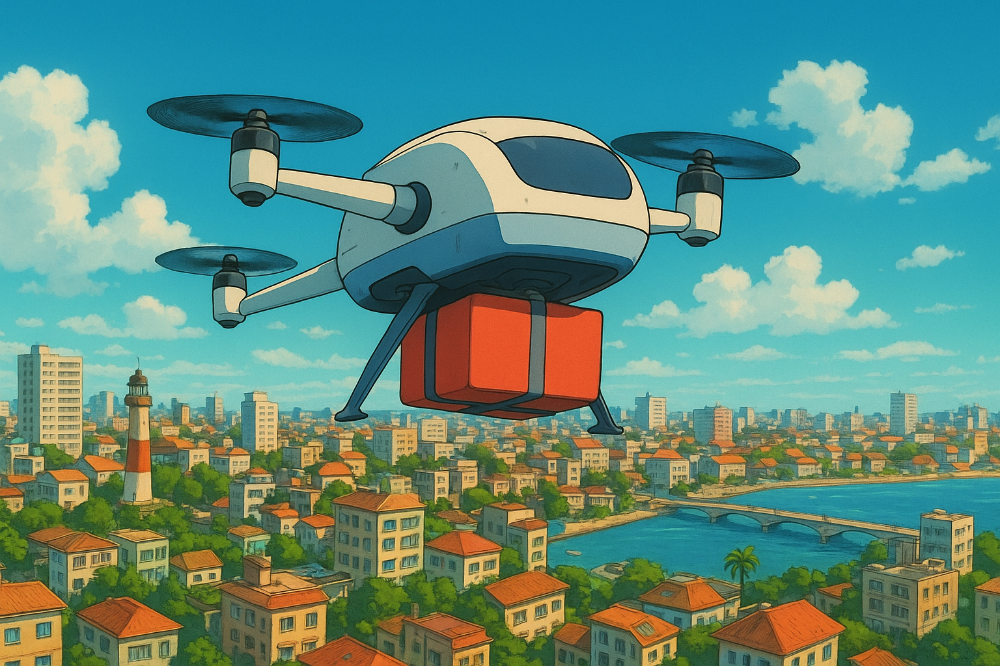

# FlyFood
- Desenvolvido como projeto do segundo período do Bacharelado em Sistemas de Informação.
- Aplicação acadêmica que simula entregas por drones, buscando a melhor rota possível em um ambiente urbano.

*Imagem meramente ilustrativa, gerada por inteligência artificial.*

## Descrição:
O FlyFood apresenta a ideia de drones realizando entregas em uma cidade. Esses drones partem de um ponto de origem carregados com vários pedidos e precisam visitar diferentes locais de entrega antes de retornar à base. No entanto, um dos grandes         desafios é a limitação da bateria, que exige que o percurso seja planejado da forma mais eficiente possível. Para resolver essa problemática, o projeto trabalha com uma matriz que representa a cidade e os pontos de entrega. A partir dessa matriz, o      algoritmo busca, por meio de força bruta, todas as rotas possíveis e identifica a de menor custo, garantindo que o drone consiga realizar todas as entregas e retornar ao ponto inicial.

## Tecnologias utilizadas:
- Python 3.12.3

## Funcionalidades do codigo: 
1. Leitura de matriz a partir de arquivo
- Lê uma matriz de um arquivo .txt e trata possíveis erros como arquivo vazio, cabeçalho inválido ou dimensões incorretas.

2. Identificação de pontos de interesse
- Detecta na matriz os pontos de entrega e o ponto de partida (R), garantindo que cada ponto seja representado por uma letra válida.

3. Cálculo de distâncias
- Calcula a distância Manhattan entre quaisquer dois pontos da matriz.

4. Geração de permutações de rotas
- Cria todas as possíveis ordens de visita aos pontos de entrega usando força bruta.

5. Cálculo de custo total das rotas
- Soma as distâncias entre pontos consecutivos para cada rota, permitindo identificar a rota mais curta.
